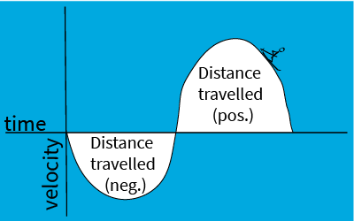
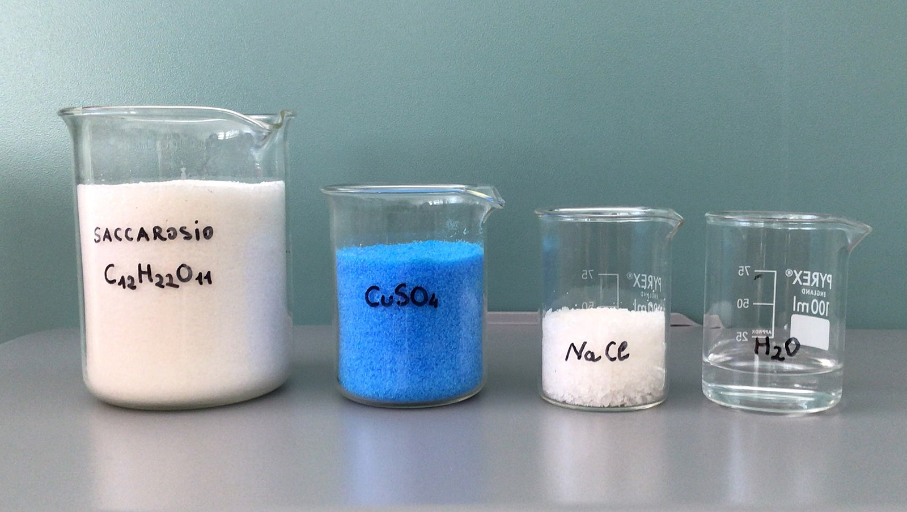
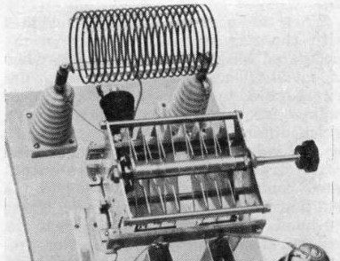
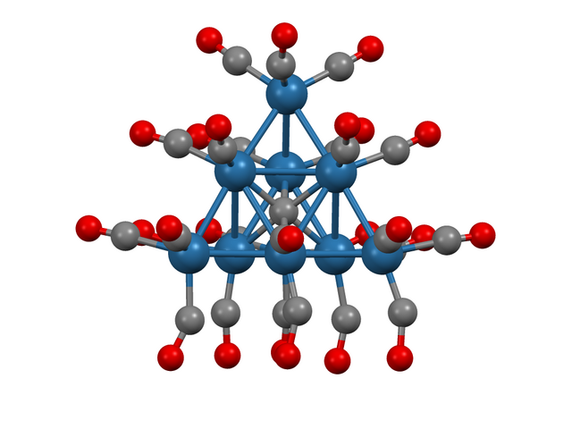
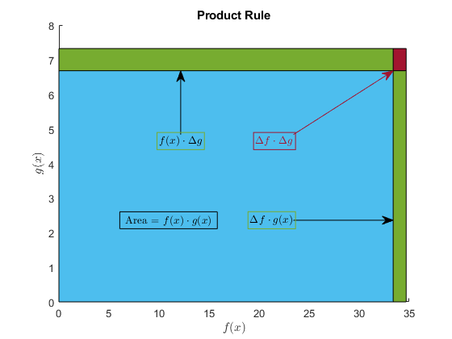
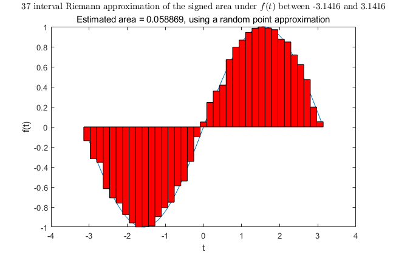
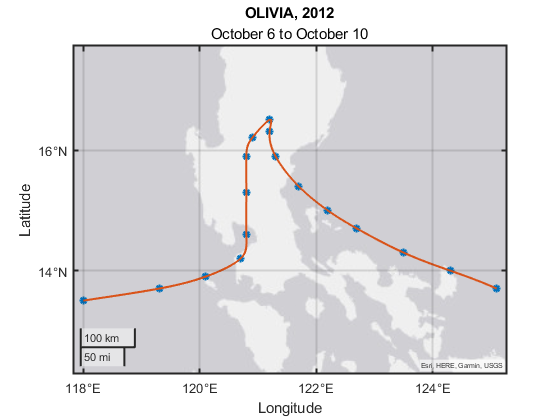
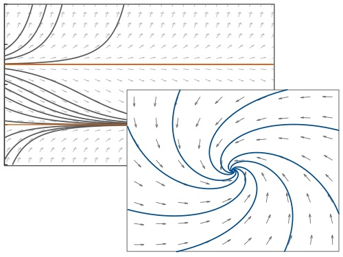

# Applied Ordinary Differential Equations

 or 

**Curriculum Module**

_Created with R2024b. Compatible with R2024b and later releases._

# Information

This curriculum module contains interactive [MATLAB® live scripts](https://www.mathworks.com/products/matlab/live-editor.html) that cover analytical methods of solving ordinary differential equations, using applications in a variety of academic disciplines.

## Background

You can use these live scripts as demonstrations in lectures, class activities, or interactive assignments outside class. This module covers core topics from an introductory differential equations course. This includes solving first\-order equations using separation of variables and integrating factors, solving second\-order equations using characteristic equations and the method of undetermined coefficients, and systems of differential equations by finding eigenvalues and eigenvectors. Applications of differential equations include population growth, circuits, measuring chemical concentration, and Newton's law of cooling.

The instructions inside the live scripts will guide you through the exercises and activities. Get started with each live script by running it one section at a time. To stop running the script or a section midway (for example, when an animation is in progress), use the  Stop button in the **RUN** section of the **Live Editor** tab in the MATLAB Toolstrip.

## Contact Us

Solutions are available upon instructor request. Contact the [MathWorks teaching resources team](mailto:onlineteaching@mathworks.com) if you would like to request solutions, provide feedback, or if you have a question.

## Prerequisites

This module assumes a background in calculus (taking derivatives and integrals), which are covered by related courseware modules. Minimal prior MATLAB experience required, as the focus of the scripts are mostly analytical techniques, but [MATLAB Onramp](https://matlabacademy.mathworks.com/details/matlab-onramp/gettingstarted) can be used to acquire familiarity with live scripts and MATLAB syntax.

## Getting Started
### Accessing the Module
### **On MATLAB Online:**

Use the  link to download the module. You will be prompted to log in or create a MathWorks account. The project will be loaded, and you will see an app with several navigation options to get you started.

### **On Desktop:**

Download or clone this repository. Open MATLAB, navigate to the folder containing these scripts and double\-click on [AppliedODEs.prj](https://matlab.mathworks.com/open/github/v1?repo=MathWorks-Teaching-Resources/Applied-ODEs&project=AppliedODEs.prj&file=README.mlx). It will add the appropriate files to your MATLAB path and open an app that asks you where you would like to start. 

Ensure you have all the required products (listed below) installed. If you need to include a product, add it using the Add\-On Explorer. To install an add\-on, go to the **Home** tab and select   **Add-Ons** > **Get Add-Ons**. 

## Products

MATLAB is used throughout, and tools from the Symbolic Math Toolbox™ are used frequently as well.

# Scripts
## [**Classification.mlx**](https://matlab.mathworks.com/open/github/v1?repo=MathWorks-Teaching-Resources/Applied-ODEs&project=AppliedODEs.prj&file=Scripts/Classification.mlx)
|      |      |      |
| :-: | :-- | :-- |
|     | **In this script, students will...**   $\bullet$ identify independent and dependent variables in differential equations   $\bullet$ distinguish between ordinary and partial differential equations   $\bullet$ classify differential equations by order, linearity, and homogeneity    | **Academic disciplines**   $\bullet$ Mathematics     |
|      |      |       |

## [**SeparationOfVariables.mlx**](https://matlab.mathworks.com/open/github/v1?repo=MathWorks-Teaching-Resources/Applied-ODEs&project=AppliedODEs.prj&file=Scripts/SeparationOfVariables.mlx)
|      |      |      |
| :-: | :-- | :-- |
|     | **In this script, students will...**   $\bullet$ determine whether ordinary differential equations are separable   $\bullet$ solve first\-order ordinary differential equations analytically using separation of variables     | **Applications**   $\bullet$ Logistic population growth model   **Academic disciplines**   $\bullet$ Mathematics   $\bullet$ Biology     |
|      |      |       |

## [**IntegratingFactors.mlx**](https://matlab.mathworks.com/open/github/v1?repo=MathWorks-Teaching-Resources/Applied-ODEs&project=AppliedODEs.prj&file=Scripts/IntegratingFactors.mlx)
|      |      |      |
| :-: | :-- | :-- |
|     | **In this script, students will...**   $\bullet$ find integrating factors of linear, first\-order ordinary differential equations   $\bullet$ solve equations analytically by multiplying by integrating factors    | **Applications**   $\bullet$ Chemical concentration   **Academic disciplines**   $\bullet$ Mathematics   $\bullet$ Chemistry     |
|      |      |       |

## **CharacteristicEquations.mlx** **(Planned)**
|      |      |      |
| :-: | :-- | :-- |
|     | **In this script, students will...**   $\bullet$ find characteristic equations of linear, second\-order ordinary differential equations   $\bullet$ use the roots of characteristic equations to solve homogeneous equations analytically    | **Applications**   $\bullet$ RLC Circuits   $\bullet$ Mass\-spring\-damper   **Academic disciplines**   $\bullet$ Mathematics   $\bullet$ Engineering   $\bullet$ Physics     |
|      |      |       |

## **UndeterminedCoefficients.mlx** **(Planned)**
|      |      |      |
| :-: | :-- | :-- |
|     | **In this script, students will...**   $\bullet$ solve linear, second\-order, nonhomogeneous ordinary differential equations analytically using the method of undetermined coefficients    | **Applications**   $\bullet$ Pendulum motion   $\bullet$ Chemical bonds   **Academic disciplines**   $\bullet$ Mathematics   $\bullet$ Physics   $\bullet$ Chemistry     |
|      |      |       |

## **SystemsOfODEs.mlx** **(Planned)**
|      |      |      |
| :-: | :-- | :-- |
|     | **In this script, students will...**   $\bullet$ write systems of linear, homogeneous, first\-order differential equations in matrix form   $\bullet$ find eigenvalues and eigenvectors of these matrices   $\bullet$ solve systems of ODEs analytically using these eigenvalues and eigenvectors    | **Applications**   $\bullet$ SIR model of epidemiology   $\bullet$ Earthquake effects on buildings   **Academic disciplines**   $\bullet$ Mathematics   $\bullet$ Biology   $\bullet$ Engineering     |
|      |      |       |

# License

The license for this module is available in the [LICENSE.md](https://github.com/MathWorks-Teaching-Resources/Applied-ODEs/blob/release/LICENSE.md).

# Related Courseware Modules
## [Applied Partial Differential Equations](https://www.mathworks.com/matlabcentral/fileexchange/172650-applied-partial-differential-equations)
|      |      |
| :-- | :-- |
|     | **Available on:**         [GitHub](https://github.com/MathWorks-Teaching-Resources/Applied-PDEs)     |
|      |       |

## [Calculus Derivatives](https://www.mathworks.com/matlabcentral/fileexchange/99249-calculus-derivatives)
|      |      |
| :-- | :-- |
|     | **Available on:**         [GitHub](https://github.com/MathWorks-Teaching-Resources/Calculus-Derivatives)     |
|      |       |

## [Calculus Integrals](https://www.mathworks.com/matlabcentral/fileexchange/105740-calculus-integrals)
|      |      |
| :-- | :-- |
|     | **Available on:**         [GitHub](https://github.com/MathWorks-Teaching-Resources/Calculus-Integrals)     |
|      |       |

## [Numerical Methods with Applications](https://www.mathworks.com/matlabcentral/fileexchange/111490-numerical-methods-with-applications)
|      |      |
| :-- | :-- |
|     | **Available on:**         [GitHub](https://github.com/MathWorks-Teaching-Resources/Numerical-Methods-with-Applications)     |
|      |       |

## [Qualitative Analysis of ODEs](https://www.mathworks.com/matlabcentral/fileexchange/95513-qualitative-analysis-of-odes)
|      |      |
| :-- | :-- |
|     | **Available on:**         [GitHub](https://github.com/MathWorks-Teaching-Resources/Qualitative-Analysis-of-ODEs)     |
|      |       |

Or feel free to explore our other [modular courseware content](https://www.mathworks.com/matlabcentral/fileexchange/?q=tag%3A%22courseware+module%22&sort=downloads_desc_30d).

# Educator Resources
-  [Educator Page](https://www.mathworks.com/academia/educators.html) 

# Contribute 

Looking for more? Find an issue? Have a suggestion? Please contact the [MathWorks teaching resources team](mailto:%20onlineteaching@mathworks.com). If you want to contribute directly to this project, you can find information about how to do so in the [CONTRIBUTING.md](https://github.com/MathWorks-Teaching-Resources/Applied-ODEs/blob/release/CONTRIBUTING.md) page on GitHub.

 *©* Copyright 2024 The MathWorks, Inc

